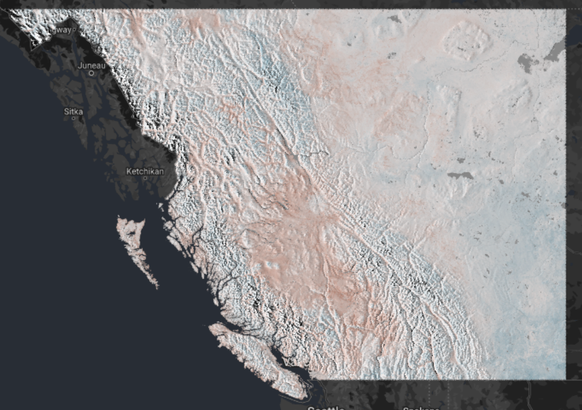

Here we present a workflow and code for refining ClimateNA temperature predictions [@wang2016locally] using temperature data loggers and remote sensing accessed via Google Earth Engine. View temperature offsets and spatial data at <https://bgcasey.users.earthengine.app/view/climateoffsets>. View model summaries at <https://bookdown.org/bgcasey/climateOffset_models/>.

Ecological studies often rely on interpolated climate data to predict species distributions and identify climate change refugia. However, the scale of climate data does not always correspond to the scale of habitat conditions influencing organisms. ClimateNA, a freely available software package, addresses this by providing scale-free predictions of climate variables by interpolating gridded climate data and adjusting for elevation. While useful, ClimateNA predictions could be improved by incorporating other variables that influence micro-climatic variation. We developed methods to refine ClimateNA air temperature predictions using temperature data loggers and remote sensing data accessed via Google Earth Engine. Monthly temperature variables from 2005-2021 were calculated using near-surface temperatures gathered from 513 monitoring sites across Alberta, Canada. We used variables associated with terrain, vegetation structure, and atmospheric conditions in boosted regression trees to predict differences between ClimateNA temperature predictions and micro-climate conditions. We produced 30 m seasonal offset layers for mean, maximum, and minimum temperatures covering all of Alberta and British Columbia. Mean summer temperatures were on average -0.03°C (SD = 0.71) greater than ClimateNA predictions; maximum summer temperatures were on average 6.81°C (SD = 1.11) less than CimateNA predictions; and winter minimum temperatures were on average -0.81°C (SD = 0.98) greater than CimateNA predictions. Offset adjusted ClimateNA predictions should better reflect micro-climatic variation and improve the accuracy of species-habitat models.

```{r GlobalOptions, echo=FALSE}
options(bookdown.render.file_scope = FALSE, knitr.duplicate.label = "allow") 
knitr::opts_chunk$set(cache.path = "5_cache/")
knitr::opts_knit$set(root.dir = rprojroot::find_rstudio_root_file())
```

```{r setup, include=FALSE, cache=FALSE}
#Set root directory to R project root
knitr::opts_knit$set(root.dir = rprojroot::find_rstudio_root_file())
```

```{r echo=FALSE, out.width = '100%'}
library(kableExtra)
library(knitr)
library(readxl)
```

# Import and clean temperature data

First we gathered temperature data from temperature data loggers deployed across the province of Alberta.

```{r echo=FALSE}
iButton_sources <- read_excel("0_data/iButton_sources.xlsx")

kable(iButton_sources, format="simple", caption = ' Sources of temperature data loggers.')
```

The file `1_code/r_notebooks/1_ibutton_data_prepare.Rmd` provides code and instructions for importing and cleaning iButton temperature data. We did the following for each data source:

1.  Imported temperature data into the r project.
2.  Identified and removed pre-deployment and post-retrieval temperature data.
3.  Identified and fixed errors in date-time strings.
4.  Identified and fixed errors in site names and made sure that each iButton deployment was associated with a unique identifier.
5.  Calculated daily temperature summaries including:
    -   **Tmax (maximum temperature)**

    -   **Tmin (minimum temperature)**

    -   **Tavg (mean temperature)**
6.  Combined daily temperature data from all sources into a single data frame.

# Get XY coordinates of data loggers

The file `1_code/r_notebooks/2_ibutton_data_xy.Rmd` provides code and instructions for generating spatial dataframes and shapefiles from iButton coordinates. The file describes how to:

1.  Get XY coordinates of iButton locations.
2.  Convert a data frame with XY coordinates into a spatial data frame using the `sf` package in R [@R-sf].
3.  Export the spatial data frame as a shape file. The shape file of point locations was later uploaded as an asset to Google Earth Engine and used to extract environmental variables.
4.  Create a map of the study area and iButton locations using the `tmap` package in R [@R-tmap].

```{r studyArea, echo=FALSE, fig.cap= "Locations of temperature data loggers.", out.width = "80%"}
knitr::include_graphics("3_output/maps/ss_xy.png")
```

# Temperature data quality control

The file `1_code/r_notebooks/3_ibutton_qualityControl.Rmd` provides code and instructions for flagging outlier temperature data and identifing iButtons that were covered by snow during deployment. Once outliers were flagged and removed, we interpolated missing data and calculated monthly temperature metrics (Tmax, Tmin, and Tavg). The markdown file details the following steps:

1.  Remove the first and last months of a temperature time series if they have less than 20 days of data.
2.  Flag outlier temperatures. Calculate the difference between daily temperature metrics from iButton data and daily estimates from ERA5 [@hersbach2018era5]. We flagged iButton data with temperature differences above Mean + 3\**SD* and below Mean - 3\**SD.*
3.  Impute missing data with a maximum gap of 10 days using the `na_interpolation` function in the R package `imputeTS` [@imputeTS2017].
4.  Flag iButtons that may have been buried by snow. An iButton was flagged as buried if it had a diurnal temperature range of \<3 degrees for \> 25 consecutive days [@wood2017dtdf].
5.  Calculate monthly temperature summaries.
6.  Exclude months with more than 10 missing or flagged days from the final data set.

```{r echo=FALSE, message = FALSE, results="asis"}
load("0_data/manual/iButton_data/ibuttons_complete_monthly.rData")

ibuttons_complete_monthly<-ibuttons_complete_monthly%>%mutate(across(where(is.numeric), round, 3))

knitr::kable(head(ibuttons_complete_monthly), "pipe") 
```

# ClimateNA temperature

The file `1_code/r_notebooks/4_ibutton_climatesNA.Rmd` provides instructions for:

1.  Installing the ClimateNA desktop application and R package [@wang2016locally].
2.  Extracting monthly ClimateNA temperature predictions for each iButton location.
3.  Calculating the difference between monthly iButton and ClimateNA temperature metrics.

```{r echo=FALSE, message = FALSE, results="asis"}
load("0_data/manual/iButton_data/iButton_cNA_diff.rData")

iButton_cNA_diff<-iButton_cNA_diff%>%mutate(across(where(is.numeric), round, 3))

knitr::kable(head(iButton_cNA_diff), "pipe") 
```

# Spatial covariates

Spatial covariates were extracted using Google Earth Engine's online code editor at [code.earthengine.google.com](http://code.earthengine.google.com/).

You cam download the Google Earth Engine scripts by entering `git clone https://earthengine.googlesource.com/users/bgcasey/climate_downscaling` into your working directory. Earth engine scripts can also be found as .js files in `1_code/GEE/`. Just copy them them into the Google Earth online code editor.

The file `1_code/r_notebooks/5_covariates_gee_spatial.Rmd` provides code for:

1.  Cloning the GEE project's git and accessing the GEE code.
2.  Importing csv files of summarized covariates generated in Google Earth Engine.
3.  Importing and processing raster layers for each covariate. All were generated in Google Earth Engine.
4.  Setting up data for use in boosted regression trees.

We calculated and/or extracted the following metrics in Google Earth Engine:

```{r covDes, echo=FALSE, message = FALSE, results="asis"}
covariate_list<- read_excel("0_data/covariate_list.xlsx", sheet="Sheet2")

kable(covariate_list, format="simple", caption = 'Spatial covariates evaluated and used in our analysis.')

# kable(covariate_list, align = c("l", "l", "r", "r")) 
# # 
# %>%
#   # kable_paper() %>%
#   column_spec(1, bold = T, border_right = T, width="5em") %>%
#   column_spec(2, width = "75em")%>%
#   column_spec(3, width = "15em")

```

# Boosted regression trees {.unnumbered}

We used the spatial variables extracted via Google Earth Engine in boosted regression trees to predict differences between ClimateNA and iButton temperatures. The file `1_code/r_notebooks/6_boosted_regression_trees.Rmd` provides the code and methods used. We built boosted regression trees using the `dismo` and `gbm` R packages. We repeated the following steps for Tmax, Tmin, and Tavg for the summer, fall, winter, and spring seasons:

1.  Tune BRT parameters using a grid of parameter options and the `gbm` R package [@kuhn2013applied; @R-gbm].

2.  Build models using the tuned parameters in the `gbm.step` function from the `dismo` package [@R-dismo]

3.  Drop variables that don't improve model performance using `dismo::gbm.simplify`.

4.  Rerun models with the reduced set of predictor variables.

5.  Generate offset rasters from the final models using `dismo::predict` (see `1_code/r_notebooks/7_make_predictive_offset_raster.Rmd` for the code).

```{r offset_eg, echo=FALSE, out.width = "100%"}

```

# References

::: {#refs}
:::

<!--chapter:end:index.Rmd-->

