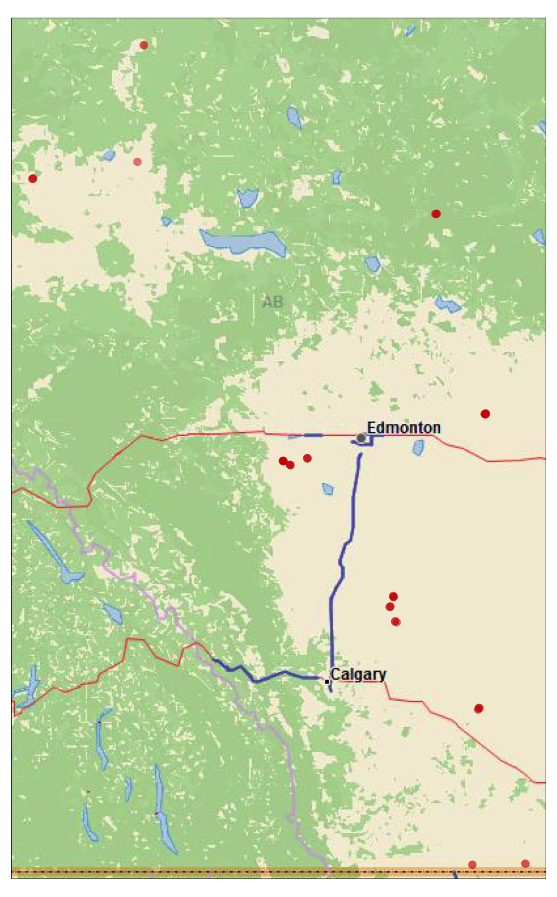

-   <a href="#overview" id="toc-overview">Overview</a>
-   <a href="#ibutton-data" id="toc-ibutton-data">iButton Data</a>
    -   <a href="#gather" id="toc-gather">Gather</a>
    -   <a href="#setup" id="toc-setup">Setup</a>
    -   <a href="#combine-ibutton-data" id="toc-combine-ibutton-data">Combine
        ibutton data</a>
    -   <a href="#clean" id="toc-clean">Clean</a>
-   <a href="#covariates" id="toc-covariates">Covariates</a>
    -   <a href="#ibutton-deployment" id="toc-ibutton-deployment">iButton
        deployment</a>
    -   <a href="#spatial" id="toc-spatial">Spatial</a>
-   <a href="#modelling" id="toc-modelling">Modelling</a>
    -   <a href="#data-exploration-and-visualization"
        id="toc-data-exploration-and-visualization">Data exploration and
        visualization</a>
    -   <a href="#model-selection" id="toc-model-selection">Model selection</a>
    -   <a href="#offset-raster" id="toc-offset-raster">Offset raster</a>
    -   <a href="#validate" id="toc-validate">Validate</a>
-   <a href="#references" id="toc-references">References</a>

# Overview

# iButton Data

## Gather

## Setup

##### Load libraries

``` r
library(sf)
library(tmap)
library(basemaps)
```

##### Import ibutton data

``` r
hills<-read.csv(file="0_data/external/Hills_iButton_Data_Combined_Corrected_for_Deployment_no_extremes_Apr_27.csv")

RIVR<-read.csv(file="0_data/external/iButtons_RIVR_combined_April7_2022_no_extremes.csv")
```

## Combine ibutton data

##### Create spatial data frame of iButton locations

``` r
RIVR_xy<-RIVR%>%
  dplyr::select(c(Project, Site_StationKey, Date_deplo, Lat, Long))%>%
  dplyr::distinct()

RIVR_xy<-st_as_sf(RIVR_xy, coords=c("Long","Lat"), crs=4326)

# save as spatial data frame
save(RIVR_xy, file="0_data/manual/spatial/RIVR_xy.rData")

# save as shapefile
st_write(RIVR_xy, "0_data/manual/spatial/RIVR_xy.shp")

# buffer points
RIVR_xy_buff<-st_buffer(RIVR_xy, 100)

# save as spatial data frame
save(RIVR_xy_buff, file="0_data/manual/spatial/RIVR_xy_buf.rData")

# save as shapefile
st_write(RIVR_xy_buff, "0_data/manual/spatial/RIVR_xy_buf.shp")
```

##### Identify study area

``` r
#create a bounding box around study area
bb<-st_bbox(RIVR_xy)

#Get aspect ratio of bounding box
bb<-st_as_sfc(bb)
bb<-st_as_sf(bb)
bb_buf<-st_buffer(bb, 10000)
bb_buf<-st_bbox(bb_buf)
bb_buf<-st_as_sfc(bb_buf)
bb_buf<-st_as_sf(bb_buf)

study_area<-bb_buf

# save as spatial data frame
save(study_area, file="0_data/manual/spatial/study_area.rData")

# save as shapefile
st_write(study_area, "0_data/manual/spatial/study_area.shp")
```

``` r
# Plot

# get basemap
base<-basemap_raster(study_area, map_service = "esri", map_type = "delorme_world_base_map")

# get aspect ratio of the study area
asp <- (study_area$ymax - study_area$ymin)/(study_area$xmax - study_area$xmin)

# m<-tm_shape(alberta)+tm_borders()+tm_fill(col = "#fddadd")+
#   #tm_polygons(col=NA, border.col="black")+
#   tm_layout(frame=FALSE)+
#   tm_legend(outside=TRUE, frame=FALSE)+
m<-tm_shape(base)+
  tm_rgb()+
  tm_shape(RIVR_xy)+
    tm_symbols(col = "#D00D00", border.lwd = 0, size = .3, alpha=.3, title.shape="iButton locations", legend.format = list(text.align="right", text.to.columns = TRUE))
  #tm_legend(position=c("left", "top"), frame=TRUE)
m

tmap_save(m, "3_output/maps/RIVR_xy.png")
```



## Clean

------------------------------------------------------------------------

# Covariates

## iButton deployment

## Spatial

Spatial covariates were extracted using Google Earth Engine’s online
code editor at
[code.earthengine.google.com](http://code.earthengine.google.com/).

------------------------------------------------------------------------

# Modelling

## Data exploration and visualization

## Model selection

## Offset raster

## Validate

# References

<div id="refs">

</div>

<!--chapter:end:index.Rmd-->
