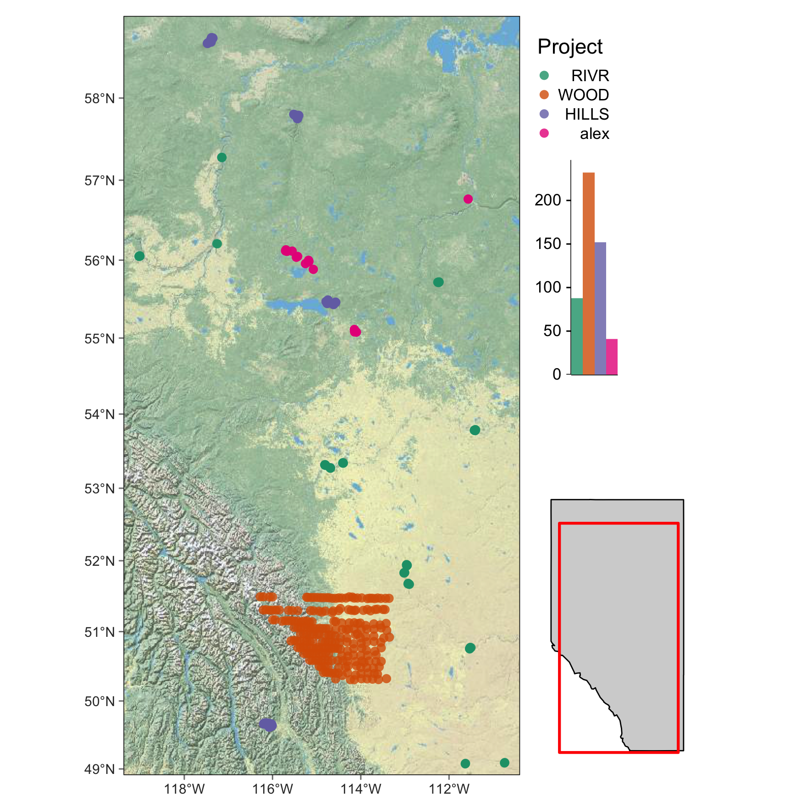

- <a href="#import-and-clean-temperature-data"
  id="toc-import-and-clean-temperature-data">Import and clean temperature
  data</a>
- <a href="#get-xy-coordinates-of-data-loggers"
  id="toc-get-xy-coordinates-of-data-loggers">Get XY coordinates of data
  loggers</a>
- <a href="#temperature-data-quality-control"
  id="toc-temperature-data-quality-control">Temperature data quality
  control</a>
- <a href="#climatena-temperature"
  id="toc-climatena-temperature">ClimateNA temperature</a>
- <a href="#spatial-covariates" id="toc-spatial-covariates">Spatial
  covariates</a>
- <a href="#references" id="toc-references">References</a>

Here we present our workflow and code for refining ClimateNA temperature
predictions using temperature data loggers and remote sensing data
accessed via Google Earth Engine. Temperature offset layers and project
spatial data can be viewed at
<https://bgcasey.users.earthengine.app/view/climateoffsets>.

Ecological studies often rely on interpolated climate data to predict
species distributions and identify climate change refugia. However, the
scale of climate data does not always correspond to the scale of habitat
conditions influencing organisms. ClimateNA, a freely available software
package, addresses this by providing scale-free predictions of climate
variables by interpolating gridded climate data and adjusting for
elevation. While useful, ClimateNA predictions could be improved by
incorporating other variables that influence micro-climatic variation.
We developed methods to refine ClimateNA air temperature predictions
using temperature data loggers and remote sensing data accessed via
Google Earth Engine. Monthly temperature variables from 2005-2021 were
calculated using near-surface temperatures gathered from 513 monitoring
sites across Alberta, Canada. We used variables associated with terrain,
vegetation structure, and atmospheric conditions in boosted-regression
trees to predict differences between ClimateNA temperature predictions
and micro-climate conditions. We produced 30 m seasonal offset layers
for mean, maximum, and minimum temperatures covering all of Alberta and
British Columbia. Mean summer temperatures were on average -0.03°C (SD =
0.71) greater than ClimateNA predictions; maximum summer temperatures
were on average 6.81°C (SD = 1.11) less than CimateNA predictions; and
winter minimum temperatures were on average -0.81°C (SD = 0.98) greater
than CimateNA predictions. Offset adjusted ClimateNA predictions should
better reflect micro-climatic variation and improve the accuracy of
species-habitat models.

# Import and clean temperature data

First we gathered temperature data from temperature data loggers
deployed across the province of Alberta.

| Project code | Number of loggers | Time frame | Region  | Reference                                                           |
|:-------------|------------------:|:-----------|:--------|:--------------------------------------------------------------------|
| RIVR         |                88 | 2018-2020  | Alberta | Estevo et al. ([2022](#ref-estevoTopographicVegetationDrivers2022)) |
| HILLS        |               152 | 2014-2016  | Alberta | NA                                                                  |
| WOOD         |               232 | 2005-2010  | Alberta | Wood et al. ([2017](#ref-wood2017dtdf))                             |
| ALEX         |                41 | 2020       | Alberta | NA                                                                  |

Sources of temperature data loggers.

The file `1_code/r_notebooks/1_ibutton_data_prepare.Rmd` provides code
and instructions for importing and cleaning data from both raw and
processed iButton temperature data. We did the following for each source
of iButton data:

1.  Imported temperature data into the r project.
2.  Identified and removed pre-deployment and post-retrieval temperature
    data.
3.  Identified and fixed errors in date-time strings.
4.  Identified and fixed errors in iButton site names and made sure that
    each iButton deployment was associated with a unique identifier.
5.  Calculated daily temperature summaries including:
    - **Tmax (maximum temperature)**

    - **Tmin (minimum temperature)**

    - **Tavg (mean temperature)**
6.  Combined daily temperature data from all sources into a single data
    frame.

# Get XY coordinates of data loggers

The file `1_code/r_notebooks/2_ibutton_data_xy.Rmd` provides code and
instructions for generating spatial dataframes and shapefiles of iButton
locations in R. We:

1.  Get XY coordinates of iButton locations.
2.  Convert data frame with coordinates to a spatial dataframe using the
    `sf` package ([Pebesma 2022](#ref-R-sf)).
3.  Export as a shape file. The shape file will of point locations was
    later uploaded as an asset to Google Earth Engine and used to
    extract environmental variables.
4.  Create a map of the study area using the `tmap` package in R
    ([Tennekes 2022](#ref-R-tmap)).

Locations of temperature data loggers.

# Temperature data quality control

The file `1_code/r_notebooks/3_ibutton_qualityControl.Rmd` provides code
and instructions for flagging outlier temperature data and identify
iButtons that were grounded or covered by snow during their deployment.
Once outliers were flagged and removed, we interpolated missing
temperature data, and calculated monthly temperature metrics (Tmax,
Tmin, and Tavg). The markdown file describes the following steps:

1.  Remove the first and last months of a temperature time series if it
    only had 20 days or less of data.
2.  Indentify temperature outliers by calculating the difference the
    daily temperature metrics we calculated and daily temperature
    estimates from ERA5 ([Hersbach et al. 2018](#ref-hersbach2018era5)).
    We flagged and iButton data with temperature differences that were
    above (Mean + 3\**SD*) and temperature differences below (Mean -
    3\**SD*)
3.  Impute missing data with a maximum gap of 10 days useing the
    `na_interpolation` function in the r package `imputeTS` ([Moritz and
    Bartz-Beielstein 2017](#ref-imputeTS2017)).
4.  Flag iButtons that may have been buried by snow. An iButton was
    flagged as buried if it had diurnal temperature range of \<3 degrees
    for 25 consequetive days or more ([Wood et al.
    2017](#ref-wood2017dtdf)).
5.  Calculate monthly temperature summaries.
6.  Exclude months with more than 10 missing or flagged days from our
    data set.

| Project | Site_StationKey | Month | Year | Tmax_Month | Tmin_Month | Tavg_Month |
|:--------|:----------------|------:|-----:|-----------:|-----------:|-----------:|
| alex    | 10_B            |     8 | 2020 |     15.138 |      7.590 |     15.138 |
| alex    | 10_B            |     9 | 2020 |      9.278 |      0.670 |      9.278 |
| alex    | 10_B            |    10 | 2020 |     -0.945 |     -7.545 |     -0.945 |
| alex    | 10_B            |    11 | 2020 |     -5.873 |    -12.753 |     -5.873 |
| alex    | 10_B            |    12 | 2020 |     -6.405 |    -11.101 |     -6.405 |
| alex    | 10_B            |     1 | 2021 |     -4.806 |     -7.047 |     -4.806 |

# ClimateNA temperature

The file `1_code/r_notebooks/4_ibutton_climatesNA.Rmd` provides
instructions for:

1.  Installing the ClimateNA desktop application and r package ([Wang et
    al. 2016](#ref-wang2016locally)).
2.  Extracting monthly ClimateNA temperature predictions for each
    iButton location.
3.  Calculating difference between monthly iButton and ClimateNA
    temperature metrics.

| Project | Site_StationKey | Month | Year | Tmax_Month | Tmin_Month | Tavg_Month | Tmax_cNA | Tmin_cNA | Tavg_cNA | Tmax_diff | Tmin_diff | Tavg_diff |
|:--------|:----------------|------:|-----:|-----------:|-----------:|-----------:|---------:|---------:|---------:|----------:|----------:|----------:|
| alex    | 10_B            |     8 | 2020 |     15.138 |      7.590 |     15.138 |     21.5 |      8.0 |     14.8 |      6.36 |      0.41 |     -0.34 |
| alex    | 10_B            |     9 | 2020 |      9.278 |      0.670 |      9.278 |     16.4 |      3.2 |      9.8 |      7.12 |      2.53 |      0.52 |
| alex    | 10_B            |    10 | 2020 |     -0.945 |     -7.545 |     -0.945 |      5.1 |     -4.7 |      0.2 |      6.05 |      2.84 |      1.15 |
| alex    | 10_B            |    11 | 2020 |     -5.873 |    -12.753 |     -5.873 |     -1.3 |    -11.6 |     -6.5 |      4.57 |      1.15 |     -0.63 |
| alex    | 10_B            |    12 | 2020 |     -6.405 |    -11.101 |     -6.405 |     -4.8 |    -14.6 |     -9.7 |      1.60 |     -3.50 |     -3.30 |
| alex    | 10_B            |     1 | 2021 |     -4.806 |     -7.047 |     -4.806 |     -9.6 |    -19.9 |    -14.7 |     -4.79 |    -12.85 |     -9.89 |

# Spatial covariates

Spatial covariates were extracted using Google Earth Engine’s online
code editor at
[code.earthengine.google.com](http://code.earthengine.google.com/).

Download the Google Earth Engine script by using
`git clone https://earthengine.googlesource.com/users/bgcasey/climate_downscaling`
into your working directory. Earth engine sripts are also contained as
.js files in `1_code/GEE/`. Just copy them them into the Google Earth
online code editor.

The file `1_code/r_notebooks/5_covariates_gee_spatial.Rmd` provides code
for:

1.  Cloning the GEE git file and copying the projects .js files.
2.  Importing csv files of the summarized covariates generated in Google
    Earth Engine.
3.  Importing and processing raster layers for each covariate (generated
    in Google Earth Engine).
4.  Setting up data for use in boosted regression trees.

We calculated/extracted the following metrics in Google Earth Engine:

| Variable                  | Description                                                                                                                                            | Resolution (m) | Source                                                      |
|:--------------------------|:-------------------------------------------------------------------------------------------------------------------------------------------------------|---------------:|:------------------------------------------------------------|
| elevation                 | NA                                                                                                                                                     |          23.19 | Canada ([2015](#ref-natural2015canadian))                   |
| slope                     | NA                                                                                                                                                     |          23.19 | Canada ([2015](#ref-natural2015canadian))                   |
| aspect                    | NA                                                                                                                                                     |          23.19 | Canada ([2015](#ref-natural2015canadian))                   |
| northness                 | cosign of aspect in radians                                                                                                                            |          23.19 | Canada ([2015](#ref-natural2015canadian))                   |
| TPI                       | Topographic Position Index, TPI neigborhoods range from 50-1000 meters.                                                                                |          23.19 | Canada ([2015](#ref-natural2015canadian))                   |
| HLI                       | Heat Load Index                                                                                                                                        |          23.19 | Canada ([2015](#ref-natural2015canadian))                   |
| TWI                       | Topographic Wetness Index: ln(α/tanβ)) where α=cumulative upslope drainage area and β is slope ([Sørensen and Seibert 2007](#ref-sorensen2007effects)) |          92.77 | Yamazaki et al. ([2019](#ref-yamazaki2019merit))            |
| NDVI                      | Normalized Difference Vegetation Index: (NIR - R) / (NIR + R)                                                                                          |          30.00 | Survey ([2018](#ref-geologicalsurveyLandsat47Surface2018))  |
| EVI                       | Enhanced Vegetation Index: G \* ((NIR - R) / (NIR + C1 \* R – C2 \* B + L))                                                                            |          30.00 | Survey ([2018](#ref-geologicalsurveyLandsat47Surface2018))  |
| BSI                       | Bare Soil Index: ((R+SWIR) – (NIR+B)) / ((R+SWIR) + (NIR+B))                                                                                           |          30.00 | Survey ([2018](#ref-geologicalsurveyLandsat47Surface2018))  |
| SAVI                      | Soil Adjusted Vegetation Index: ((NIR - R) / (NIR + R + L)) \* (1 + L)                                                                                 |          30.00 | Survey ([2018](#ref-geologicalsurveyLandsat47Surface2018))  |
| NDMI                      | Normalized Difference Moisture Index: (NIR - SWIR) / (NIR + SWIR)                                                                                      |          30.00 | Survey ([2018](#ref-geologicalsurveyLandsat47Surface2018))  |
| SI                        | Shadow index: (1 - B) \* (1 - G) \* (1 - R)                                                                                                            |          30.00 | Survey ([2018](#ref-geologicalsurveyLandsat47Surface2018))  |
| LAI                       | Leaf Area Index: 3.618 *(2.5 * ((NIR - R) / (NIR + 6 \* R - 7.5 \* B + 1)))-0.118                                                                      |          30.00 | Survey ([2018](#ref-geologicalsurveyLandsat47Surface2018))  |
| NDSI                      | Normalized Difference Snow Index: (G - SWIR) / (G- SWIR)                                                                                               |          30.00 | Survey ([2018](#ref-geologicalsurveyLandsat47Surface2018))  |
| snow                      | percent of snow cover                                                                                                                                  |          30.00 | Survey ([2018](#ref-geologicalsurveyLandsat47Surface2018))  |
| discrete_classification   | Land cover classification                                                                                                                              |         100.00 | Buchhorn et al. ([2020](#ref-buchhorn2020copernicus))       |
| forest_type               | Forest type for all pixels with tree cover \> 1 %                                                                                                      |         100.00 | Buchhorn et al. ([2020](#ref-buchhorn2020copernicus))       |
| tree-coverfraction        | Percent of forest vegetation cover                                                                                                                     |         100.00 | Buchhorn et al. ([2020](#ref-buchhorn2020copernicus))       |
| cloud_fraction            | Fractional cloud cover                                                                                                                                 |       11132.00 | Heidinger et al. ([2014](#ref-heidinger2014noaa))           |
| cloud_probabilty          | probability of cloud cover                                                                                                                             |       11132.00 | Heidinger et al. ([2014](#ref-heidinger2014noaa))           |
| aet                       | Actual evapotranspiration                                                                                                                              |        4638.30 | Abatzoglou et al. ([2018](#ref-abatzoglou2018terraclimate)) |
| def                       | Climate water deficit                                                                                                                                  |        4638.30 | Abatzoglou et al. ([2018](#ref-abatzoglou2018terraclimate)) |
| pdsi                      | Palmer Drought Severity Index                                                                                                                          |        4638.30 | Abatzoglou et al. ([2018](#ref-abatzoglou2018terraclimate)) |
| pet                       | Reference evapotranspiration (ASCE Penman-Montieth)                                                                                                    |        4638.30 | Abatzoglou et al. ([2018](#ref-abatzoglou2018terraclimate)) |
| pr                        | Precipitation accumulation                                                                                                                             |        4638.30 | Abatzoglou et al. ([2018](#ref-abatzoglou2018terraclimate)) |
| ro                        | Runof                                                                                                                                                  |        4638.30 | Abatzoglou et al. ([2018](#ref-abatzoglou2018terraclimate)) |
| soil                      | Soil moisture                                                                                                                                          |        4638.30 | Abatzoglou et al. ([2018](#ref-abatzoglou2018terraclimate)) |
| srad                      | Downward surface shortwave radiation                                                                                                                   |        4638.30 | Abatzoglou et al. ([2018](#ref-abatzoglou2018terraclimate)) |
| swe                       | Snow water equivalent                                                                                                                                  |        4638.30 | Abatzoglou et al. ([2018](#ref-abatzoglou2018terraclimate)) |
| vap                       | Vapor pressure                                                                                                                                         |        4638.30 | Abatzoglou et al. ([2018](#ref-abatzoglou2018terraclimate)) |
| vpd                       | Vapor pressure deficit                                                                                                                                 |        4638.30 | Abatzoglou et al. ([2018](#ref-abatzoglou2018terraclimate)) |
| vs                        | Wind-speed at 10m                                                                                                                                      |        4638.30 | Abatzoglou et al. ([2018](#ref-abatzoglou2018terraclimate)) |
| CHILI                     | Continuous Heat-Insolation Load Index                                                                                                                  |          90.00 | Theobald et al. ([2015](#ref-theobald2015ecologically))     |
| canopy_height             | model trained with GEDI LiDAR to retrieve canopy height from Sentinel-2 images                                                                         |          10.00 | Lang et al. ([2022](#ref-lang2022high))                     |
| canopy_standard_deviation | model trained with GEDI LiDAR to retrieve standard deviation of canopy height from Sentinel-2 images                                                   |          10.00 | Lang et al. ([2022](#ref-lang2022high))                     |

Spatial covariates evaluated and used in our analysis.

# References

Abatzoglou, John T, Solomon Z Dobrowski, Sean A Parks, and Katherine C
Hegewisch. 2018. “TerraClimate, a High-Resolution Global Dataset of
Monthly Climate and Climatic Water Balance from 1958–2015.” *Scientific
Data* 5 (1): 1–12.

Buchhorn, Marcel, Myroslava Lesiv, Nandin-Erdene Tsendbazar, Martin
Herold, Luc Bertels, and Bruno Smets. 2020. “Copernicus Global Land
Cover Layers—Collection 2.” *Remote Sensing* 12 (6): 1044.

Canada, Natural Resources. 2015. “Canadian Digital Elevation Model,
1945–2011.” Natural Resources Canada Ottawa, ON, Canada.

Estevo, Cesar A., Diana Stralberg, Scott E. Nielsen, and Erin Bayne.
2022. “Topographic and Vegetation Drivers of Thermal Heterogeneity Along
the Boreal–Grassland Transition Zone in Western Canada: Implications for
Climate Change Refugia.” *Ecology and Evolution* 12 (6): e9008.
https://doi.org/<https://doi.org/10.1002/ece3.9008>.

Heidinger, AK, Michael J Foster, Andi Walther, and Xuepeng Zhao. 2014.
“NOAA Climate Data Record (CDR) of Cloud Properties from AVHRR
Pathfinder Atmospheres-Extended (PATMOS-x), Version 5.3.” *NOAA National
Centers for Environmental Information: NOAA CDR Program*.

Hersbach, Hans, Bill Bell, Paul Berrisford, Gionata Biavati, András
Horányi, Joaquín Muñoz Sabater, Julien Nicolas, et al. 2018. “ERA5
Hourly Data on Single Levels from 1979 to Present.” *Copernicus Climate
Change Service (C3s) Climate Data Store (Cds)* 10 (10.24381).

Lang, Nico, Walter Jetz, Konrad Schindler, and Jan Dirk Wegner. 2022. “A
High-Resolution Canopy Height Model of the Earth.” *arXiv Preprint
arXiv:2204.08322*.

Moritz, Steffen, and Thomas Bartz-Beielstein. 2017. “imputeTS: Time Series Missing Value Imputation in
R.” *The R Journal* 9 (1): 207–18.
<https://doi.org/10.32614/RJ-2017-009>.

Pebesma, Edzer. 2022. *Sf: Simple Features for r*.
<https://CRAN.R-project.org/package=sf>.

Sørensen, Rasmus, and Jan Seibert. 2007. “Effects of DEM Resolution on
the Calculation of Topographical Indices: TWI and Its Components.”
*Journal of Hydrology* 347 (1-2): 79–89.

Survey, U. S. Geological. 2018. “Landsat 4-7 Surface Reflectance
(Ledaps) Product Guide.” Sioux Falls, SD, USA: Department of the
Interior, U.S. Geological Survey.

Tennekes, Martijn. 2022. *Tmap: Thematic Maps*.
<https://github.com/r-tmap/tmap>.

Theobald, David M, Dylan Harrison-Atlas, William B Monahan, and
Christine M Albano. 2015. “Ecologically-Relevant Maps of Landforms and
Physiographic Diversity for Climate Adaptation Planning.” *PloS One* 10
(12): e0143619.

Wang, Tongli, Andreas Hamann, Dave Spittlehouse, and Carlos Carroll.
2016. “Locally Downscaled and Spatially Customizable Climate Data for
Historical and Future Periods for North America.” *PloS One* 11 (6):
e0156720.

Wood, Wendy H, Shawn J Marshall, Shannon E Fargey, and Terri L
Whitehead. 2017. “Daily Temperature Data from the Foothills Climate
Array Mesonet, Canadian Rocky Mountains, 2005-2010.” PANGAEA.
<https://doi.org/10.1594/PANGAEA.880611>.

Yamazaki, Dai, Daiki Ikeshima, Jeison Sosa, Paul D Bates, George H
Allen, and Tamlin M Pavelsky. 2019. “MERIT Hydro: A High-Resolution
Global Hydrography Map Based on Latest Topography Dataset.” *Water
Resources Research* 55 (6): 5053–73.

<!--chapter:end:index.Rmd-->
